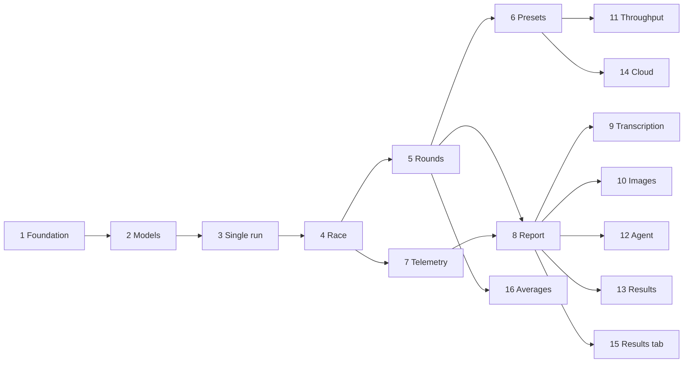

# Model Duel roadmap

Status: v1, 2026-09-24. Companion to PLAN.md, which holds the details; this file sets the build order.
When the two disagree, fix PLAN.md first, then this file.

## How this roadmap works

- Sixteen phases in five milestones. Each phase ends with a complete app that can be installed, run and
  tested on its own, with nothing half-built on screen.
- Every phase has the same shape: what you can do at the end, scope, what waits for later, mock additions,
  automated tests, a script for the real machines, and an exit checklist.
- The mock Unsloth backend grows with the app, so every phase can be tested on a laptop without GPUs. The
  real-machine script then confirms the phase on the Mac and the Linux machine.
- One phase section plus the PLAN.md sections it cites is a complete brief for whoever implements it,
  person or coding agent. A reference such as "PLAN.md 5.6" means section 5, item 6.

## Phase gate

A phase is finished only when all of these hold. "Completely testable" means exactly this list.

1. **Clean start.** From a fresh clone, `npm install` then `npm run dev` serves the app at
   http://localhost:3000 with every feature of the phase working. `npm run build` then `npm start` serves
   the production build, which is the build used for real measurements.
2. **No-GPU demo.** `npm run demo` starts two mock Unsloth backends with different speed profiles plus the
   app, with both machines already added, so every feature of the phase works on any laptop.
3. **Automated checks.** `npm run typecheck`, `npm run lint`, `npm test` (unit and integration against the
   mock) and `npm run test:e2e` (Playwright, running the phase's demo script against `npm run demo`) pass.
4. **Real machines.** The phase's real-machine script has run once against the Mac and the Linux machine,
   and the results are written to `docs/phases/phase-NN.md` using the template at the end of this file.
5. **No dead UI.** Nothing on screen is unfinished. Tabs and options from later phases are hidden, not
   disabled.
6. **Data carries forward.** Machines and sessions saved by earlier phases still open, backed by a
   migration test, or the phase record states a deliberate reset.
7. **Docs.** The README covers the phase's features and setup. PLAN.md is corrected wherever the phase
   proved it wrong.
8. **Tagged.** Phase N is tagged `v0.N`. Phase 10 is `v1.0`; phases 11 to 16 are `v1.1` to `v1.6`.

## Running a phase

1. Branch `phase-NN` from main.
2. Build the mock additions and the tests first, then the feature, so the suite stays green throughout.
3. Run the automated checks, then the real-machine script, then write the phase record.
4. Merge and tag. Findings that affect later phases go into this file before the next phase starts.

## Overview

| # | Phase | At the end you can | Needs | Size | Tag |
|---|---|---|---|---|---|
| 1 | Foundation and machines | Add each machine by URL and API key, probe it, and see what it supports | none | M | v0.1 |
| 2 | Model management | Load the same model and quant on every machine from one screen, with progress | 1 | S | v0.2 |
| 3 | Single-machine text run | Stream a prompt on one machine with a live thinking block and metrics that match Unsloth's own | 2 | M | v0.3 |
| 4 | Text race | Race two or more machines side by side and reopen any past race | 3 | M | v0.4 |
| 5 | Rounds and statistics | Run several rounds with warm-up and get medians, spread and an honest tie | 4 | S | v0.5 |
| 6 | Presets, cache control and pre-flight | Use Short, 8K and 32K presets with cold prefill, and let pre-flight stop unfair runs | 5 | M | v0.6 |
| 7 | Live telemetry and energy | Watch GPU, power, CPU, RAM and temperature live and get energy per run | 4 | M | v0.7 |
| 8 | Report and sharing | Read a scoreboard with charts and provenance, export it, blind-vote on answers | 5, 7 | M | v0.8 |
| 9 | Transcription | Race speech-to-text with real-time factor and word error rate | 8 | M | v0.9 |
| 10 | Image generation | Race image generation with a live step timeline and the images side by side | 8 | M | v1.0 |
| 11 | Throughput mode | Measure aggregate tokens per second under parallel requests | 6 | S | v1.1 |
| 12 | Agent and command workloads | Run video encodes on each machine through a small agent | 8 | L | v1.2 |
| 13 | Result files | Keep every race as a shareable JSON result in a documented, versioned format | 8 | S | v1.3 |
| 14 | Cloud reference models | Race ChatGPT, Claude and Gemini models next to local machines as references | 6 | M | v1.4 |
| 15 | Results tab | Filter, sort and download every machine's run from every race in one table | 8 | S | v1.5 |
| 16 | Long races and averages | Run up to 100 rounds and sum them up by median or average | 5 | S | v1.6 |

Sizes are rough and assume one developer working with a coding agent: S is 1 to 2 days, M is 3 to 5 days,
L is 1 to 2 weeks.

Milestones:

- **M1 First race** (phases 1 to 4, v0.4): a usable two-machine text benchmark.
- **M2 Trustworthy numbers** (phases 5 to 8, v0.8): results that survive scrutiny and can be shared.
- **M3 Three workloads** (phases 9 and 10, v1.0): transcription and images on the same machinery. This is 1.0.
- **M4 Extensions** (phases 11 and 12): throughput testing and command workloads.
- **M5 Sharing and references** (phases 13 to 16): result files ready for a public results website,
  cloud models as reference points, one table of every run, and long races summed up either way. Added on 2026-09-25 at Mani's
  request, after phase 12.

Why this order: measurement is checked on one machine against Unsloth's own numbers (phase 3) before
concurrency adds noise (phase 4). Statistics, pre-flight, telemetry and the report (phases 5 to 8) are
built once for text, so transcription and images plug into them instead of each needing their own.
Phase 7 can be built alongside phases 5 and 6. Phases 9 and 10 are independent of each other, and so are
phases 11 and 12.



## Phase 1: Foundation and machines

**You can** add each machine by URL and API key, probe it, and see its versions, hardware and which
workloads it supports.
Needs: nothing. Size: M. Cites PLAN.md 2.1, 2.2, 2.6, 3, 3.1, 9.

Scope
- Repository: git, npm workspaces `server`, `client`, `shared`, `mock`, `e2e`; TypeScript strict; ESLint
  and Prettier; Vitest; Playwright; `data/` ignored by git. One `npm run dev` runs server and client.
  Optional CI that runs the automated checks on every push.
- Controller: Fastify serving the built client and `/api/*`. It binds 127.0.0.1 by default. `--host
  0.0.0.0` is opt-in and prints a warning, since the controller has no login.
- Machine registry: add, edit, delete. Fields: name, base URL, API key, notes, accent colour. URLs are
  normalised for scheme, default port 8888 and trailing slash. Stored in `data/machines.json` with file
  mode 600. The key is write-only: responses carry a masked form and logs never contain it.
- Probe: health, system, hardware details, inference status, `/v1/models`, `/v1/props`, STT status, image
  status, one telemetry read, and three health round trips for RTT. Each capability is ok, missing or
  error, and the raw responses are kept.
- Machines screen: one card per machine with capability chips (reachable, key accepted, text, STT engines,
  image, telemetry), Unsloth and llama.cpp versions, GPU inventory, RTT, last probe time and an "Export
  probe" button.
- Plain-language errors for the usual failures: LAN access off or a firewall, a wrong or revoked key, a
  wrong port.

Not in this phase: loading models, running anything, live telemetry.

Mock additions: the probe routes; the API key check; two profiles, `mac-mlx` and `linux-cuda`; a control
route `POST /__mock/config` that switches profiles and injects failures at runtime for the tests.

Automated tests
- Unit: URL normalisation, probe classification from recorded responses, key masking.
- Integration: probe both mock profiles; a wrong key; an unreachable host with a short timeout; the key
  never appears in any response or log line.
- End-to-end, also the manual demo script: add two mock machines and probe them, all chips green; switch
  one mock to reject the key and see the auth error.

Real-machine script (prerequisites: Unsloth running on both machines)
1. On each machine, open Unsloth Settings, API, Remote & LAN, press Start and turn on "Start
   automatically", then create an API key.
2. On the third machine, add both machines and probe them.
3. Run the app on the Linux machine instead, with its own Unsloth at 127.0.0.1 and the Mac over the LAN,
   and probe both.
4. Export both probes and compare them with PLAN.md section 2.

Exit checklist
- [ ] Phase gate passes.
- [ ] Probe exports for both machines saved in `docs/phases/phase-01/`.
- [ ] PLAN.md section 2 confirmed or corrected for the installed Unsloth versions (open question 5).

## Phase 2: Model management

**You can** see every machine's models and load the same model and quant everywhere with one action, with
progress and the resolved settings read back.
Needs: 1. Size: S. Cites PLAN.md 2.2, 2.3, 5.15.

Scope
- Model list per machine from `/api/models/local` (the id each load needs, with partial downloads and
  image models left out) and `/v1/models` (which one is loaded). Loaded models first, with a text filter.
- Quants for GGUF models from `/api/models/gguf-variants` with the model's load id and `offline=true`,
  which never contacts Hugging Face. Only complete quants are offered.
- Load dialog: model, quant, context length (0 lets the backend choose), speculative decoding (default
  `off`, PLAN.md 5.15), reasoning budget (default -1). Advanced: `n_parallel`, KV cache type, extra
  llama-server arguments. Every field is sent explicitly.
- The load call runs with a 30 minute timeout while `/api/inference/load-progress` is polled at 2 Hz for
  the progress bar. Load time is recorded.
- "Load on all machines": the same model, quant and settings on every selected machine, with a warning
  where a machine lacks the files.
- Status panel per machine from `/api/inference/status`: active model, backend (GGUF or MLX), quant,
  context length, speculative method and drafter, KV cache type, GPU memory mode, reasoning support. A
  `memory_warning` shows in red.
- Cancel a running load. Unload with confirmation. Errors shown plainly: GPU busy, invalid model, and
  Unsloth's own load failure message, including one that arrives late inside a padded answer.

Not in this phase: STT and image models (phases 9 and 10), running prompts.

Mock additions: load, load-progress, unload and status transitions with simulated durations; quant
variants; failure injection; a memory warning on demand.

Automated tests
- Unit: list merge; matching the same model and quant across machines.
- Integration: load, progress and unload on the mock, including a failed load and a load with a memory
  warning.
- End-to-end, also the manual demo script: "Load on all machines" on two mocks; both bars finish; both
  status panels show the same model and settings.

Real-machine script (prerequisite: the same thinking-model GGUF quant downloaded on both machines)
1. Load it on both from the app with speculative decoding off, and compare load times.
2. Confirm that context length and speculative method read back as requested, with no memory warning.
3. Unload, then load again with a different context length.
4. Decide GGUF or MLX for the Mac (open question 1) and record the decision.

Exit checklist
- [ ] Phase gate passes.
- [ ] Text benchmark model, quant, backend and load settings recorded in the phase record.

## Phase 3: Single-machine text run

**You can** send a prompt to one machine, watch the thinking block and the answer stream live, and get
metrics whose client and server columns agree.
Needs: 2. Size: M. Cites PLAN.md 2.3, 4.1, 8, 10.

Scope
- TEXT tab with one machine selected. The chat `model` field is only informational in Unsloth, so the run
  reads the active model from status before and after, and flags a change.
- Request per PLAN.md 2.3 with `stream_options.include_usage`, thinking on or off within what
  `reasoning_always_on` and `reasoning_effort_levels` allow, and an explicit `max_tokens`. Other sampling
  fields use fixed defaults until phase 6.
- Streaming client: one keep-alive agent per machine with a long idle timeout. (Changed during the phase:
  Unsloth answers streams with `Connection: close`, so each run gets its own connection whose idle
  timeout is the run's. See PLAN.md 8.) The SSE parser in `shared/`
  stamps each read on arrival, splits events, marks coalesced events, and handles `reasoning_content`,
  `content`, `usage`, `timings`, `context_truncated`, error frames, Unsloth tool frames (ignored) and
  `[DONE]`.
- Metrics in `shared/` as pure functions of events and a clock: TTFT, first reasoning token, first answer
  token, thinking duration, decode tok/s, end-to-end tok/s, characters per second, inter-chunk statistics,
  usage totals.
- Server column: `timings` from the final chunk and the matching `/api/inference/monitor` row (`ttft_ms`,
  `tok_per_sec`, `prompt_tok_per_sec`).
- Browser: controller-to-browser SSE batched every 50 ms. One pane with the thinking block (open while
  thinking, collapsed at the first answer token), live chips (first token, tok/s, elapsed) and a final
  table with client and server columns.
- Cancel aborts the upstream socket. Idle and total timeouts.
- An event-loop lag sampler on the controller, and a banner when measuring from the dev server.
- Recorder: `npm run record` saves the raw stream with timestamps, the monitor row and the request body
  into `fixtures/`, without credentials.

Not in this phase: several machines, rounds, presets.

Mock additions: streaming chat completions with configurable startup delay, reasoning and answer token
counts, per-token latency and jitter; final usage and timings; monitor rows; injectable stalls,
disconnects, error frames and tool frames.

Automated tests
- Unit: every recording fed to the parser split at every byte offset, including inside multibyte
  characters; metric math on an injected clock; the thinking-block state machine.
- Integration: with a 300 ms mock startup delay, measured TTFT is within 20 ms of it on loopback; cancel
  stops the mock's generation; a stall trips the idle timeout; an error frame surfaces as an error.
- End-to-end, also the manual demo script: run on a mock, see the thinking block and then the answer, the
  table fills, cancel works.

Real-machine script (prerequisite: the phase 2 model loaded on both machines)
1. Run the same thinking prompt on each machine separately, with at least 256 generated tokens.
2. Check that client TTFT exceeds the server's `ttft_ms` by roughly one RTT, and that client decode tok/s
   is within 10 percent of the server's `predicted_per_second`. Explain larger gaps in the phase record.
3. Record one stream from each machine and add parser tests for both recordings.

Exit checklist
- [ ] Phase gate passes.
- [ ] Recordings from both machines committed to `fixtures/` with tests.
- [ ] Client and server agreement recorded.

## Phase 4: Text race

**You can** run the same prompt on two or more machines at once, watch them side by side, get a
comparison table, and reopen any past race.
Needs: 3. Size: M. Cites PLAN.md 3, 5.9, 5.10, 6, 7.

Scope
- Machine picker for two or more machines; panes side by side, two to four across, wrapping beyond that.
- Start check: every selected machine has a model loaded, with a warning when models, quants or backends
  differ.
- START sends identical bodies to all machines in the same tick and records the send skew between them.
- Failure isolation: a failed or timed-out machine shows FAILED with partial metrics while the others
  finish. Cancel stops all of them.
- Comparison table: metric rows by machine columns, best value highlighted. The confidence gate arrives in
  phase 5.
- Sessions saved to `data/sessions/<id>.json` with `schemaVersion: 1`, already shaped for many rounds and
  many machines: config, machines, rounds (one for now), raw events, metrics, server values, and a
  provenance snapshot of probe, status and request bodies.
- Results log: list, open, delete. Reloading the page mid-race resumes from a snapshot event.
  (As built: the running notes panel of every tab is now called Activity, and Results log is the list
  of saved races. Total time and token counts are not starred, since they depend on output length.)

Not in this phase: several rounds, statistics, telemetry, charts, exports.

Mock additions: none beyond giving the two demo mocks clearly different speeds.

Automated tests
- Integration: send skew under 5 ms on the mock; one mock killed mid-race while the other completes;
  cancel; save and reopen round trip; snapshot resume.
- End-to-end, also the manual demo script: race two mocks and the faster one wins; stop one mock mid-race
  and the other still finishes.

Real-machine script (run on the two Linux machines while the Mac was unreachable)
1. Race the Mac against the Linux machine with the phase 2 model.
2. Reopen the race from the results log.
3. Check that the provenance snapshot names both models, quants and backends.

Exit checklist
- [ ] Phase gate passes. Tag v0.4 marks milestone M1.

## Phase 5: Rounds and statistics

**You can** run several rounds with warm-up and get medians, spread, RTT per round and a tie when the
difference is within noise.
Needs: 4. Size: S. Cites PLAN.md 5.4, 5.5, 5.8, 5.9, 5.13, 5.14.

Scope
- Rounds 1 to 10 (default 3), a warm-up toggle (one short request per machine, discarded), and a settle
  delay between rounds (default 2 s).
- RTT before each round: three health requests on the keep-alive socket, per machine. A streamed run
  opens a new connection (PLAN.md 8), so its network share is about two RTTs plus Unsloth's own request
  handling, which phase 3 measured at 20 ms. (Changed during the phase: the RTT is three
  TCP handshakes, because Unsloth's HTTP answers on a reused connection stall for about 40 ms. See PLAN.md
  5.8.)
- Per metric: median, min, max, mean and sample standard deviation. A per-round table; raw rounds kept.
- Winner gate: a winner only when per-round ranges do not overlap or the median gap exceeds 10 percent;
  otherwise "tie".
- Sequencing: concurrent by default. Sequential ABBA order is offered, and suggested automatically when two
  machines resolve to the same host.
- Round flags: event-loop lag over a threshold, a high coalesced-read ratio, a failed machine.

Not in this phase: presets and cache control.

Mock additions: per-round variance and jitter settings.

Automated tests
- Unit: statistics with odd and even counts, a single round, failed rounds excluded; the gate; ABBA order;
  warm-up excluded from results.
- End-to-end, also the manual demo script: three rounds on the mocks give a three-row round table with
  medians; two mocks set to equal speed give "tie".

Real-machine script (run on the RTX machine alone while the Lenovo was offline and the Mac unreachable)
1. Run five rounds, Mac against Linux.
2. Record the RTT row and the spread as the baseline noise level of this setup.

Exit checklist
- [ ] Phase gate passes.
- [ ] Baseline noise level recorded.

## Phase 6: Presets, cache control and pre-flight

**You can** benchmark with the Short, 8K and 32K presets, cold or warm prefill and full sampling control,
and pre-flight stops runs that would not be fair.
Needs: 5. Size: M. Cites PLAN.md 2.3, 4.1, 5.1 to 5.3, 5.6, 5.7, 5.11, 5.15.

Scope
- Presets: Short; 8K and 32K built from Mill's On Liberty (Project Gutenberg) with a fixed instruction; a
  reasoning puzzle; a code task; a custom prompt.
- Sampling panel: temperature, top_p, top_k, min_p, repetition_penalty, seed, `max_tokens`, thinking on or
  off, reasoning effort. Every field is always sent.
- Prefill mode: cold by default (a random nonce at the start of the first user message plus a fixed seed),
  warm as an option.
- Run flags: a cache hit when cached tokens exceed a threshold (default 64, so chat-template tokens do not
  trigger it); `context_truncated` aborts the round; a stop on length is shown.
- Fixed-length mode: `max_tokens` N with a prompt that always overruns it. Both machines must stop on
  length, or the round is flagged. (As built: a preset asking for a 3,000-word essay. A never-ending
  counting prompt made the model stop at ten.)
- Pre-flight before START, with blocking errors and warnings: same model, quant and backend; same context
  length; exact prompt tokens from `/v1/chat/count_tokens` fit the context; same engaged speculative
  method, KV cache type and GPU memory mode; no memory warning; thinking supported where requested.

Not in this phase: throughput mode.

Mock additions: a prefix cache keyed by prompt prefix, where the `linux-cuda` profile skips the cache for
seeded requests and the `mac-mlx` profile keeps it, as Unsloth does; a context limit that produces
`context_truncated`; stops on length; the token-count route.

Automated tests
- Unit: nonce uniqueness; golden request bodies identical across machines except `model`; flag rules;
  pre-flight rules.
- End-to-end, also the manual demo script: warm mode shows cache hits from round two while cold mode shows
  none; the 32K preset against a mock with a 16K context is blocked by pre-flight.

Real-machine script (run on the RTX machine alone; the Lenovo was offline and the Mac unreachable)
1. Run the 32K preset cold for three rounds. Cached tokens stay under the threshold on both machines,
   including an MLX Mac.
2. Switch to warm mode and see cache hits from round two.
3. Run fixed-length mode and see both machines stop on length.

Exit checklist
- [ ] Phase gate passes.

## Phase 7: Live telemetry and energy

**You can** watch GPU %, GPU power, CPU %, RAM and GPU temperature on every machine live, and get peak
values and energy for every run.
Needs: 4. Size: M. Cites PLAN.md 2.6, 4.4.

Scope
- One poller per machine at 2 Hz over `/api/train/hardware` and `/api/system`, shared by the Machines
  screen and sessions, with backoff for unreachable machines and a global off switch.
- Chips on machine cards and race panes, as in the reference tool: GPU %, GPU power, CPU %, RAM used and
  total, GPU temperature, and VRAM on GPUs with their own memory.
- Samples stored with each run, with 5 s of baseline before and after.
- Per run: peak GPU %, peak memory, mean power while decoding, energy by trapezoid integral, and tokens per
  joule, all labelled approximate.
- Edge cases: the first Apple power sample is null; missing sensors show "n/a"; a slow read never overlaps
  the next poll.

Not in this phase: Neural Engine and CPU power, which Unsloth does not report. The agent in phase 12 can
add them.

Mock additions: telemetry that ramps with activity, and a null first power sample on the Mac profile.

Automated tests
- Unit: energy with irregular sampling and gaps; aligning samples to run phases.
- Integration: poller backoff and recovery.
- End-to-end, also the manual demo script: chips move during a race on the mocks.

Real-machine script (run on the RTX machine alone, against nvidia-smi, while the Lenovo was offline)
1. Compare the chips with Unsloth's own GPU monitor on each machine.
2. Check that energy per run is close to mean power times duration.
3. Run the same round with telemetry on and off, and record the cost of polling.

Exit checklist
- [ ] Phase gate passes.
- [ ] Polling cost recorded.

## Phase 8: Report and sharing

**You can** read a finished race as a scoreboard with charts and provenance, export it, and blind-vote on
the answers.
Needs: 5, 7. Size: M. Cites PLAN.md 5.7, 5.12, 5.14, 7.

Scope
- A scoreboard band with ratio sentences on length-independent metrics only, subject to the winner gate.
- Race chart: cumulative tokens against time per machine, with reasoning shaded. Telemetry chart: power
  and token rate over time. One small charting library, uPlot suggested.
- Provenance panel: Unsloth and llama.cpp versions, backend, model, quant, context length, slots,
  speculative method, KV cache type, GPU memory mode, GPU inventory, system snapshot, exact request bodies,
  machine notes.
- Exports: JSON (the full session), CSV (comparison and round tables), and a Markdown summary. API keys
  are never included.
- Blind vote: names and colours hidden, pane order shuffled, a vote per round (left, right or tie), reveal
  after voting, and a tally per model pair across sessions.
- A session schema bump if needed, with a migration and its test.

Not in this phase: new workloads.

Mock additions: none.

Automated tests
- Unit: golden tests that CSV and Markdown match the on-screen tables; scoreboard sentence rules; blind
  mode puts no machine identity in the page before the reveal.
- End-to-end, also the manual demo script: export all three formats and parse them; complete a blind vote.

Real-machine script (run on the RTX machine alone while the Lenovo was offline and the Mac unreachable)
1. Produce the 8K, cold, five-round report for Mac against Linux.
2. Read the Markdown export outside the app and check that it stands alone.

Exit checklist
- [ ] Phase gate passes. Tag v0.8 marks milestone M2.

## Phase 9: Transcription

**You can** race speech-to-text across machines and get processing time, real-time factor and word error
rate.
Needs: 8. Size: M. Cites PLAN.md 2.4, 4.2.

Scope
- TRANSCRIBE tab. Per machine: model (tiny to large-v3, or a Hugging Face id), engine (transformers, gguf,
  mtmd) and device, with availability from STT status. The engine and device that actually served are read
  back and shown.
- Audio: a bundled clip of LibriSpeech test-clean utterances from one speaker (CC BY 4.0, verified
  transcripts), a "long" preset that repeats it to N minutes as 16 kHz mono WAV, or an uploaded file with
  optional reference text.
- Each round: make sure the model is loaded (the sidecar unloads after five idle minutes), clear the
  monitor, send with `verbose_json` and an explicit language, stamp body sent and response start, then read
  the monitor row.
- Metrics: upload time, processing time (client and server), real-time factor, model load time, and word
  error rate after normalising case, punctuation and numbers.
- Transcripts side by side, with differences from the reference highlighted.
- Rounds, statistics, telemetry, scoreboard and exports come from phases 5 to 8.

Not in this phase: segment timestamps, which the local engines do not return.

Mock additions: STT status, load, unload and transcription routes; processing delay per audio second by
profile; deterministic word errors; idle unload on a short test timer.

Automated tests
- Unit: WER normalisation and alignment; WAV concatenation; the upload and processing split.
- End-to-end, also the manual demo script: a transcription race on the mocks shows real-time factor and
  WER.

Real-machine script (prerequisites: the same STT model on both machines; whisper-server built, open
question 2. In phase 9 only pre-flight ran, on the RTX machine: a race loads a speech model next to the
chat model, which waits for Mani's go-ahead)
1. Run large-v3-turbo with the gguf engine on both machines for three rounds.
2. Confirm the served engine on each machine. A Mac without whisper-server must show that it fell back to
   transformers.

Exit checklist
- [ ] Phase gate passes.

## Phase 10: Image generation

**You can** race image generation with a live step timeline and see the images side by side.
Needs: 8. Size: M. Cites PLAN.md 2.5, 4.3.

Scope
- IMAGE tab. Per machine image model load: repo, checkpoint file or quant, memory mode, speed mode (off by
  default), quant options. Resolved settings are read back from image status: engine, device, dtype,
  transformer quant, offload policy, speed optimisations.
- Pre-flight warns when resolved settings differ, which is expected across CUDA and Apple Silicon, and the
  report prints them.
- GPU hand-off: loading an image model evicts the chat model on that machine. The UI says so, and the
  session can reload the previous text model at the end.
- Generation with a fixed prompt, size, steps, guidance and seed. Generate-progress is polled at 10 Hz and
  the image is fetched from the gallery.
- Metrics: load time, time to first step, steps per second, total, decode tail, seconds per image, energy
  per image. Step times have 100 ms resolution, which the UI states.
- Images side by side with their seeds and settings.

Not in this phase: image editing workflows, LoRAs, video.

Mock additions: image status, load, load-progress, generate, generate-progress, gallery file and unload; a
step clock per profile; a deterministic PNG per seed; chat eviction on image load.

Automated tests
- Unit: step rate and decode tail from progress timelines; eviction handling.
- End-to-end, also the manual demo script: an image race on the mocks shows progress and both images.

Real-machine script (prerequisite: the same image model and quant on both machines, open question 3. In
phase 10 only pre-flight and the model list ran, on the RTX machine: a race unloads its chat model, which
waits for Mani's go-ahead)
1. Run three rounds at 1024 by 1024 with a fixed seed.
2. Record the resolved settings of both machines in the phase record.

Exit checklist
- [ ] Phase gate passes. Tag v1.0 marks milestone M3.

## Phase 11: Throughput mode

**You can** measure how many tokens per second each machine delivers under N parallel requests.
Needs: 6. Size: S. Cites PLAN.md 2.3, 4.1.

Scope
- A TEXT tab mode switch: latency (default) or throughput with N concurrent requests per machine.
- Pre-flight: N must not exceed the loaded slots (`parallel_slots` in status, `total_slots` in
  `/v1/props`), with a shortcut to reload with more slots.
- Metrics: aggregate output tok/s, per-request TTFT median and p95, queue wait from the monitor's queue
  state, total time.

Not in this phase: mixed workloads.

Mock additions: slots, a FIFO queue, and per-slot speed that falls as concurrency rises.

Automated tests
- Unit: throughput aggregation; queue accounting.
- End-to-end, also the manual demo script: a throughput run on the mocks with four concurrent requests.

Real-machine script (run on the RTX machine alone, whose model was already loaded with four slots)
1. Load the model with four slots on both machines, then run with one, two and four concurrent requests.
2. Record the throughput curve in the phase record.

Exit checklist
- [ ] Phase gate passes.

## Phase 12: Agent and command workloads

**You can** run video encodes and other allowlisted commands on each machine with the same panes,
telemetry and report.
Needs: 8. Size: L. Cites PLAN.md 3.

Scope
- Agent: a small Node service from this repo, started on each machine, with a bearer token. `POST /jobs`
  accepts an allowlisted command template and its parameters, and `GET /jobs/:id/stream` streams events. It
  never runs arbitrary strings.
- Command workload: ffmpeg presets for HEVC (VideoToolbox on the Mac, NVENC on NVIDIA), ProRes on the Mac,
  and software x265 on both as a CPU comparison. The source clip must exist on each machine and is checked
  by checksum.
- COMMAND tab with preset chips as in the reference tool. Progress is parsed from ffmpeg. Metrics: wall
  time, frames per second, speed factor, output size.
- Optional agent telemetry: CPU and Neural Engine power on the Mac through macmon, and extra nvidia-smi
  fields on Linux.
- Machine cards gain an agent URL and token, and the probe covers the agent.

Not in this phase: arbitrary scripts, remote file transfer.

Mock additions: none in the Unsloth mock. The agent ships a fake command with scripted progress for tests.

Automated tests
- Unit: the ffmpeg progress parser on recorded output; rejection of anything outside the allowlist.
- End-to-end, also the manual demo script: the agent on localhost runs the fake command through the
  COMMAND tab.

Real-machine script (prerequisites: ffmpeg and the source clip on both machines, the agent running. In
phase 12 it ran on the RTX machine alone, NVENC and x265; the Mac's macmon step waits for the Mac)
1. Run the HEVC hardware encode and the x265 software encode on both machines.
2. Confirm that the Mac's extra telemetry appears when macmon is installed.

Exit checklist
- [ ] Phase gate passes.

## Phase 13: Result files

**You can** find every finished race as one JSON file with all its details, in a documented and
versioned public format, ready to be shared on a results website later.
Needs: 8. Size: S. Cites PLAN.md 7.1.

Scope
- A result format separate from the session file: `format: "model-duel-result"`, `formatVersion: 1`,
  settings, machines (hardware, software, model state, the exact request, the setup table), every round
  and run with a `metrics` map keyed by `metricDefinitions`, the full workload details, telemetry, the
  token timeline and raw events, the statistics, the scoreboard and blind votes.
- Written to `data/results/` when a race ends, rewritten after a blind vote, removed with the race, and
  written at startup for earlier races. Downloadable from the report.
- Privacy: no keys or tokens, no machine addresses or notes, and local paths and network addresses
  replaced in messages and settings. Prompts and answers stay.
- A SHA-256 over canonical JSON, a JSON Schema generated from the zod definition, `docs/result-format.md`,
  and `npm run verify-result`.

Not in this phase: uploading to a website, signing, anonymising machine names.

Automated tests
- Unit: the result follows its schema; metrics per run; redaction of paths and addresses; canonical JSON;
  the committed JSON Schema matches the definition.
- Integration: a race writes a result that equals the download and passes its checksum; a vote rewrites
  it; deleting the race removes it; earlier races get theirs at startup.
- End-to-end: the report's **Result file** downloads a valid file with no machine address in it.

Exit checklist
- [ ] Phase gate passes.

## Phase 14: Cloud reference models

**You can** add OpenAI, Anthropic and Google Gemini as cloud participants with an API key, pick a model
from the provider's own list, and race it on the Text tab next to local machines as a reference.
Needs: 6. Size: M. Cites PLAN.md 2.7.

Scope
- Cloud participants on the Machines screen: provider, API key (kept like the Unsloth keys), and a model
  chosen from the provider's model list, which the app fetches and filters to text models.
- Text races with cloud participants: each provider's streaming API mapped onto the same events, so
  first token, first answer word, thinking time, decode speed and token counts are measured the same
  way. Thinking and effort mapped to each provider's own controls; sampling fields each provider
  accepts are sent, the rest left out and noted.
- Pre-flight notes that a cloud model's times include the internet and the provider's queue, and that
  the requests are billed. Telemetry, energy, the Models tab and the other workloads skip cloud
  participants.
- Result files and the report name the provider and model.

Not in this phase: cloud transcription and image generation.

Mock additions: fake OpenAI, Anthropic and Gemini endpoints for the model lists and streaming.

Automated tests
- Unit: each provider's stream parsed into the same events; model list filtering; request bodies per
  provider and model family.
- Integration and end-to-end: a race between a mock machine and the three mock providers.

Real-machine script: with Mani's keys, list the models of each provider and race one of each against
the RTX machine on the Short preset.

Exit checklist
- [ ] Phase gate passes.

## Phase 15: Results tab

**You can** see every machine's run from every finished race in one table, filter it by machine,
GPU, model, quant, context, KV cache, slots, prompt and more, sort it by any column, and download it.
Needs: 8. Size: S. Cites PLAN.md 7.2.

Scope
- One row per machine per finished race: hardware (GPU, GPU memory, platform, RAM, system,
  versions), the model and how it was loaded (quant, engine, context, KV cache type, GPU layers,
  slots, speculative decoding, GPU memory mode), the race's settings, and the medians of every
  metric, equal to the race's report.
- A Results tab: workload choice, search, filter lists with counts, sorting, a star on the best value
  of each metric among the rows shown, columns picked per workload, CSV of the rows shown, and a link
  to each race.

Not in this phase: charts across races, comparing a machine with itself over time, sharing the
table.

Automated tests
- Unit: rows from a session, including partial and failed machines, cloud models and several GPUs;
  column text; the quant in a GGUF file name; CSV.
- Integration: rows after a race equal the report's medians, carry no key or address, and follow
  new and deleted races.
- End-to-end: after a race, find its rows, filter, sort, pick columns, open the race, download CSV,
  and fit a phone screen.

Real-machine script: open the Results tab on Mani's saved races and check the rows against each
race's report.

Exit checklist
- [ ] Phase gate passes.

## Phase 16: Long races and averages

**You can** run up to 100 rounds, and sum them up by median or average, before the race or after.
Needs: 5. Size: S. Cites PLAN.md 5.14.

Scope
- Rounds from 1 to 100.
- The plan's statistic, median by default or average, used by the winner gate, the comparison
  table, the scoreboard, the results log, the exports and the result file.
- A switch in the report's Comparison table that changes a finished race, and one in the Results
  tab that shows every row either way.

Automated tests
- Unit: the average changes a verdict an outlier round decides; the report, scoreboard, Markdown
  and log follow the statistic; result rows keep both.
- Integration: a twelve-round race summed up by average; switching a finished race rewrites its
  result file with a valid checksum; 101 rounds are refused.
- End-to-end: switching in the report and in the Results tab.

Real-machine script: none needed; the numbers come from the rounds already measured.

Exit checklist
- [ ] Phase gate passes.

## Testing across phases

- **Mock.** The mock Unsloth backend grows phase by phase, as each phase lists. Its profiles copy the
  verified behaviour in PLAN.md section 2, including the differences between the Mac and Linux profiles.
- **Recordings.** Every phase that touches a new real route records at least one real response or stream
  from each machine and adds a test that replays it. The mock can replay recordings with their original
  timing.
- **Golden sessions.** From phase 4 on, a fixed-seed demo session whose metrics must stay within
  tolerance in every later phase. This catches measurement regressions.
- **Unsloth updates.** After updating Unsloth on either machine, rerun the probe and record a fresh stream
  before benchmarking. A changed route should fail the probe rather than produce wrong numbers.

## Real-machine prerequisites

| Phase | On both machines |
|---|---|
| 1 | Unsloth running, LAN access on, an API key |
| 2 | the chosen text model and quant downloaded |
| 3 to 8 | nothing new |
| 9 | the chosen STT model downloaded, whisper-server built |
| 10 | the chosen image model and quant downloaded |
| 11 | nothing new |
| 12 | ffmpeg, the source clip, the agent running |
| 13 | nothing new |
| 14 | nothing on the machines; an API key from each provider to race |
| 15 | nothing new |
| 16 | nothing new |

## Open questions and when they block

| Question from PLAN.md section 13 | Needed by |
|---|---|
| 1. Models, quants, and GGUF or MLX on the Mac | phase 2 real-machine script |
| 2. whisper-server on each machine | phase 9 |
| 3. Image model and quant, speed mode baseline | phase 10 |
| 4. Bundled audio or your own files | phase 9, with bundled LibriSpeech as the default |
| 5. Unsloth version per machine | phase 1, which the probe answers |

## Risks

| Risk | Phases | Mitigation |
|---|---|---|
| An Unsloth update changes a route or field | all | probe and a fresh recording after every update; recordings pin expectations |
| Wi-Fi jitter distorts client numbers | 3 to 6 | server columns, RTT per round, rounds and medians |
| The Mac runs MLX while Linux runs GGUF | 2 to 6 | pre-flight warning, provenance, decision recorded in phase 2 |
| Speculative decoding engages differently per machine | 2 to 6 | sent explicitly, off by default, read back and compared |
| Prefix cache makes later rounds look fast | 5 and 6 | cold mode by default, cache flags on every run |
| Telemetry polling slows the machine under test | 7 | off switch, cost measured once |
| Loading an image model evicts the chat model | 10 | explicit hand-off, optional reload afterwards |
| Image settings resolve differently per platform | 10 | settings read back, printed, warned about |
| The agent becomes a remote execution hole | 12 | allowlisted templates only, token, LAN only |
| A cloud key leaks or reaches the wrong provider | 14 | kept like Unsloth keys, never in results or the browser, saved keys used only for their own provider |
| A provider changes its API or model list | 14 | contracts in one module, fake providers copy them, errors shown in the provider's words |

## Phase record template

Save as `docs/phases/phase-NN.md`.

```markdown
# Phase NN record

- Date:
- Commit and tag:
- Unsloth version per machine:
- Machines (name, hardware, OS):
- Controller location (third machine, or which machine):

## Gate
- [ ] Clean start, dev and production builds
- [ ] Demo on mocks
- [ ] Typecheck, lint, unit, integration and end-to-end tests pass
- [ ] Real-machine script done (results below)
- [ ] No dead UI
- [ ] Earlier data still opens
- [ ] README and PLAN.md updated

## Real-machine results
Numbers, screenshots, exported files.

## Findings
Bugs, surprises, PLAN.md corrections, and follow-ups for later phases.
```
